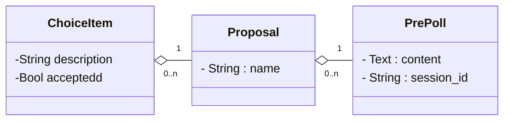

```mermaid
classDiagram
  direction RL
  class PrePoll {
    - Text : content
    - String : session_id
  }
  class Proposal {
    - String : name
  }
  class ChoiceItem {
    -String description
    -Bool acceptedd
  }
  Proposal "1" --o "0..n" ChoiceItem 
  PrePoll "1" --o "0..n" Proposal 

```

編集者用画面

提案者用画面

提案用モーダルダイアログ

編集用画面の操作

編集用画面の説明

提案用画面の説明

提案用モーダルダイアログの説明
提案用モーダルダイアログの説明
